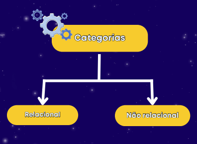

# 📌 Anotações de Banco de dados
# 🖥️ Cliente-Servidor e Introdução ao Banco de dados

## 🔹 Client-Server

- É a relação de cliente e servidor. O cliente estará solicitando algo que um servidor estará disponibilizando.

### 🏠 Cliente

- O Cliente é a parte responsável por solicitar. Ele sempre ira iniciar essa conversa, ou seja, não podemos ter dados retornados.

### 💾 Servidor 
- São aqueles supercomputadores que tem grandes capacidades de armazenamento. Nos servidores temos os dados de uma aplicação armazenados.

## 🗄️ Introdução à Banco de Dados

- Uma coleção de dados que estão se **relacionando** e representam informações sobre um domínio específico.

    ### 📅 Quando Surgiram?
    - Surgiu na década de 1960 na empresa IBM.

    ### 🎯 Objetivo
    - O objetivo era reduzir os custos de trabalho de armazenamento, organização e indexação de dados e arquivos

## 🛠️ SGBD

- Sigla para Sistema de Gerenciamento de Banco de Dados. É um software que possui recursos para manipular os Objetos e os dados do banco de dados 

## 🔹 BD 
> A tecnologia para o banco de dados

## 🔹 SGBD
> Software para manipular e escrever códigos SQL

## 🔹 SBD
> É o conjunto de tudo abordado acima.
